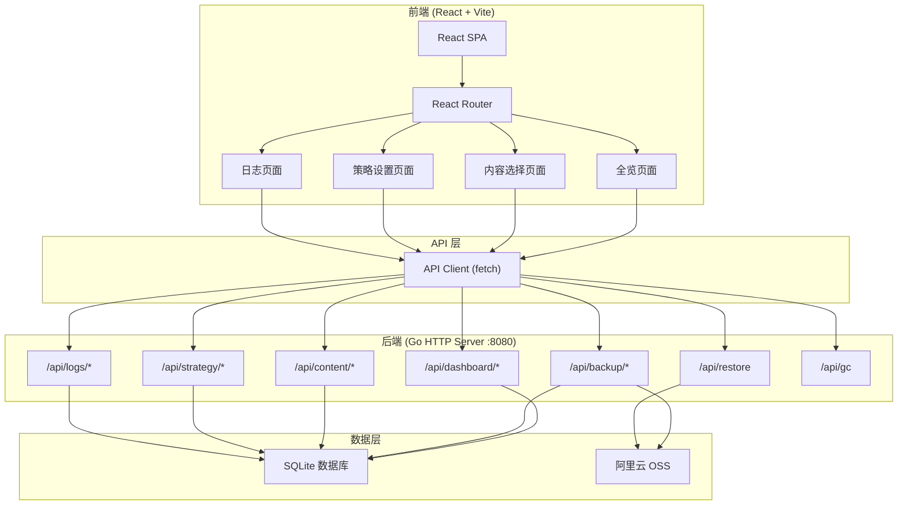
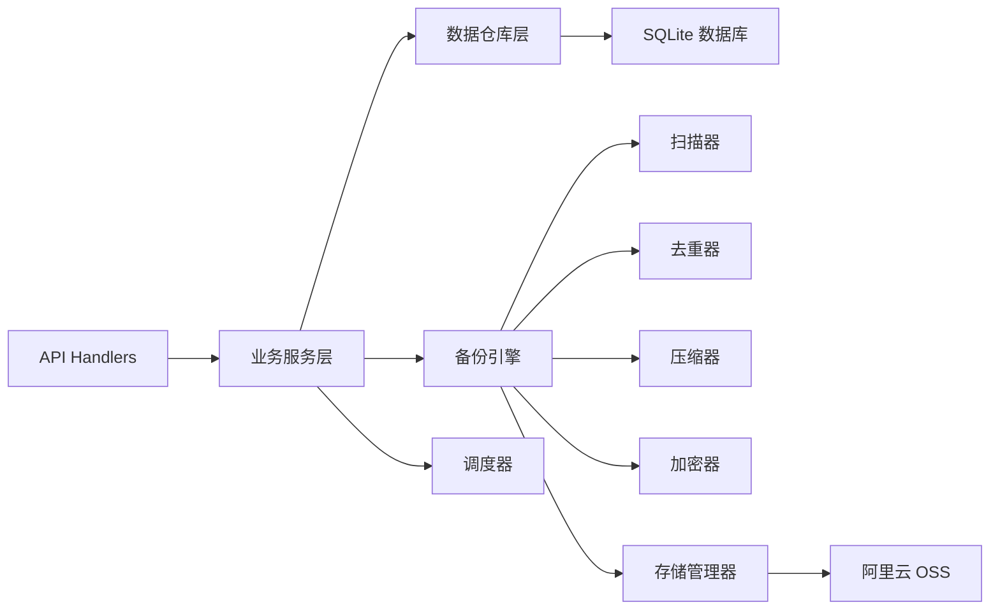
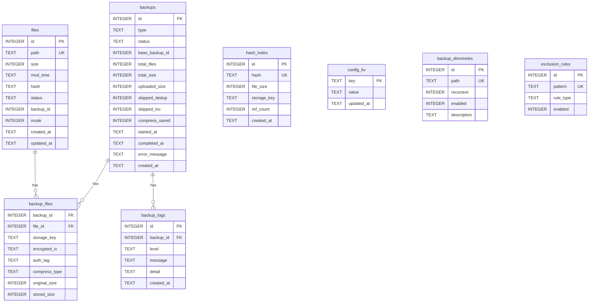

## 1. 架构设计



## 2. 技术说明

- **前端框架**：React 18 + TypeScript + Vite
- **初始化工具**：vite-init (react-ts 模板)
- **样式方案**：Tailwind CSS 3
- **状态管理**：Zustand
- **路由**：React Router DOM v6
- **图标**：Lucide React
- **HTTP 请求**：原生 fetch API（封装为统一 API Client）
- **后端**：已有 Go HTTP 服务（端口 8080），无需新建后端
- **数据库**：已有 SQLite，无需新建

## 3. 路由定义

| 路由 | 用途 |
|------|------|
| `/` | 全览页面 - 备份状态仪表盘 |
| `/content` | 内容选择页面 - 目录与排除规则管理 |
| `/strategy` | 策略设置页面 - 调度/压缩/上传/保留/加密配置 |
| `/logs` | 日志页面 - 日志查看与过滤 |

## 4. API 定义

### 4.1 统一响应类型

```typescript
interface APIResponse<T> {
  success: boolean;
  data?: T;
  error?: string;
}

interface PaginatedResponse<T> {
  success: boolean;
  data: T[];
  total: number;
  page: number;
  size: number;
}
```

### 4.2 仪表盘 API

```typescript
interface DashboardStats {
  total_files: number;
  total_size: number;
  backed_up_files: number;
  backed_up_size: number;
  oss_storage_used: number;
  last_backup_time: string | null;
  last_backup_status: string | null;
  next_backup_time: string | null;
  saved_by_dedup: number;
  saved_by_compress: number;
  active_backup_running: boolean;
}

interface BackupRecord {
  id: number;
  type: string; // "full" | "incremental"
  status: string; // "pending" | "running" | "completed" | "failed" | "cancelled"
  base_backup_id: number | null;
  total_files: number;
  total_size: number;
  uploaded_size: number;
  skipped_dedup: number;
  skipped_inc: number;
  compress_saved: number;
  started_at: string | null;
  completed_at: string | null;
  error_message: string | null;
  created_at: string;
}

// GET /api/dashboard/stats → APIResponse<DashboardStats>
// GET /api/dashboard/history?page=1&size=20 → PaginatedResponse<BackupRecord>
```

### 4.3 备份操作 API

```typescript
interface BackupTriggerRequest {
  type: "full" | "incremental";
}

interface BackupStatus {
  is_running: boolean;
  running_backup: BackupRecord | null;
}

// POST /api/backup/trigger → APIResponse<{backup_id: number, status: string}>
// POST /api/backup/cancel?backup_id=xxx → APIResponse<{status: string}>
// GET /api/backup/status → APIResponse<BackupStatus>
```

### 4.4 内容管理 API

```typescript
interface BackupDirectory {
  id: number;
  path: string;
  recursive: boolean;
  enabled: boolean;
  description: string;
}

interface ExclusionRule {
  id: number;
  pattern: string;
  rule_type: "extension" | "directory" | "pattern" | "size_exceed";
  enabled: boolean;
}

// GET /api/content/directories → APIResponse<BackupDirectory[]>
// POST /api/content/directories → APIResponse<BackupDirectory>
// PUT /api/content/directories/:id → APIResponse<BackupDirectory>
// DELETE /api/content/directories/:id → APIResponse<{status: string}>
// GET /api/content/exclusions → APIResponse<ExclusionRule[]>
// POST /api/content/exclusions → APIResponse<ExclusionRule>
// PUT /api/content/exclusions/:id → APIResponse<ExclusionRule>
// DELETE /api/content/exclusions/:id → APIResponse<{status: string}>
```

### 4.5 策略配置 API

```typescript
interface ScheduleConfig {
  enabled: boolean;
  cron_expr: string;
  timezone: string;
}

interface CompressionConfig {
  enabled: boolean;
  algorithm: string;
  level: number;
  skip_types: string[];
}

interface UploadConfig {
  storage_class: "ColdArchive" | "Archive";
  max_concurrency: number;
  chunk_size_mb: number;
  retry_count: number;
  retry_delay_sec: number;
}

interface RetentionConfig {
  version_keep_count: number;
  orphan_grace_days: number;
  full_reset_interval: number;
  keep_deleted_days: number;
}

interface EncryptionConfig {
  algorithm: string;
  key_file_path: string;
}

// GET/PUT /api/strategy/schedule → APIResponse<ScheduleConfig>
// GET/PUT /api/strategy/compression → APIResponse<CompressionConfig>
// GET/PUT /api/strategy/upload → APIResponse<UploadConfig>
// GET/PUT /api/strategy/retention → APIResponse<RetentionConfig>
// GET/PUT /api/strategy/encryption → APIResponse<EncryptionConfig>
```

### 4.6 日志 API

```typescript
interface LogRecord {
  id: number;
  backup_id: number | null;
  level: "debug" | "info" | "warn" | "error";
  message: string;
  detail: string;
  created_at: string;
}

interface LogQueryParams {
  backup_id?: number;
  level?: string;
  search?: string;
  start_time?: string;
  end_time?: string;
  page?: number;
  page_size?: number;
}

// GET /api/logs?... → PaginatedResponse<LogRecord>
// GET /api/logs/:id → APIResponse<LogRecord>
```

### 4.7 其他 API

```typescript
interface RestoreRequest {
  paths?: string[];
  pattern?: string;
  backup_id?: number;
  output_dir: string;
  expedited?: boolean;
}

interface RestoreResult {
  total_files: number;
  restored_files: number;
  failed_files: string[];
  total_size: number;
  elapsed_ms: number;
}

// POST /api/restore → APIResponse<RestoreResult>
// POST /api/gc → APIResponse<{status: string}>
```

## 5. 后端架构图

已有后端架构（无需修改）：



## 6. 数据模型

### 6.1 数据模型定义



### 6.2 前端项目结构

```
src/
├── components/
│   ├── layout/
│   │   ├── Sidebar.tsx          # 左侧导航栏
│   │   └── AppLayout.tsx        # 应用布局框架
│   ├── ui/
│   │   ├── StatusBadge.tsx      # 状态标签
│   │   ├── GaugeChart.tsx       # 环形仪表图
│   │   ├── StatCard.tsx         # 统计卡片
│   │   ├── DataTable.tsx        # 通用数据表格
│   │   ├── SlidePanel.tsx       # 右侧滑出面板
│   │   ├── ConfirmDialog.tsx    # 确认对话框
│   │   └── Pagination.tsx       # 分页器
│   └── shared/
│       ├── LoadingSkeleton.tsx  # 加载骨架屏
│       └── EmptyState.tsx       # 空状态
├── pages/
│   ├── Dashboard.tsx            # 全览页面
│   ├── Content.tsx              # 内容选择页面
│   ├── Strategy.tsx             # 策略设置页面
│   └── Logs.tsx                 # 日志页面
├── hooks/
│   ├── useApi.ts                # API 请求 Hook
│   └── usePolling.ts            # 轮询 Hook
├── utils/
│   ├── api.ts                   # API Client 封装
│   ├── format.ts                # 格式化工具（文件大小、时间等）
│   └── constants.ts             # 常量定义
├── store/
│   └── useAppStore.ts           # Zustand 全局状态
├── App.tsx                      # 根组件 + 路由
├── main.tsx                     # 入口
└── index.css                    # 全局样式 + Tailwind
```
